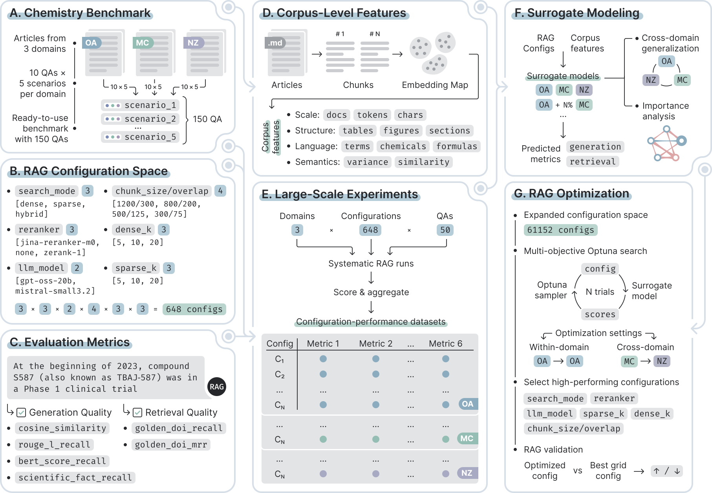

# Machine Learning-Driven RAG System Design

This repository contains the code and data workflow for the ML-driven RAG
system design project prepared for submission to NeurIPS 2026.



## Project Structure:
- data/: Input and processed data files
- src/: Source code scripts for ML pipeline
- optimization/: Source code scripts for optimization pipeline. See
  [optimization/README.md](optimization/README.md).
- results/: Evaluation results and metrics

## Installation

```bash
poetry install
poetry run python -m nltk.downloader punkt punkt_tab
poetry run python --version
```

Use `poetry run python ...` for all scripts so they run inside the project virtual
environment with the dependencies from `pyproject.toml`.

Corpus-level feature generation also requires the scispaCy model packages used
by `src/domain_features/build_db_summary.py`:

```bash
poetry run pip install \
  https://s3-us-west-2.amazonaws.com/ai2-s2-scispacy/releases/v0.5.4/en_core_sci_sm-0.5.4.tar.gz \
  https://s3-us-west-2.amazonaws.com/ai2-s2-scispacy/releases/v0.5.4/en_ner_bionlp13cg_md-0.5.4.tar.gz \
  https://s3-us-west-2.amazonaws.com/ai2-s2-scispacy/releases/v0.5.4/en_ner_bc5cdr_md-0.5.4.tar.gz
```

## Running ML pipelines

### 1. Generate corpus-level features

Before preprocessing the RAG result tables, generate corpus-level summary
features and prepare their compressed PCA representation. The summary table is
saved to `data/db/summary.csv`, and the PCA features used by preprocessing are
saved to `data/db/PCA_features.csv`.

```bash
poetry run python src/domain_features/build_db_summary.py
poetry run python src/domain_features/summary_pca.py
```

See [data/db/README.md](data/db/README.md) for the full description of the
corpus-level feature sources, columns, and metrics.

### 2. Preprocess data

Preprocess one raw results table:

```bash
poetry run python src/ml/preprocess.py data/rag_results/oxazo_results.csv
```

By default, preprocessing does not add corpus-level features. To add
the PCA reduced corpus-level features from `data/db/PCA_features.csv`, pass
`--summary-features`:

```bash
poetry run python src/ml/preprocess.py data/rag_results/oxazo_results.csv --summary-features
```

Without summary features, the script writes processed files to
`data/processed/<dataset_name>_no_summary/train.csv` and
`data/processed/<dataset_name>_no_summary/test.csv`. With `--summary-features`,
it writes to `data/processed/<dataset_name>/`.

### 3. Train baseline models

Train and evaluate baseline models (XGBoost, CatBoost, LightGBM, RandomForest,
ExtraTrees) on one processed dataset:

```bash
poetry run python src/ml/train_models.py data/processed/oxazo_no_summary
```

Outputs are saved to `results/<dataset_name>/train_models/model_selection_metrics.csv`.

### 3.1. LightGBM dataset mix sweep

Train LightGBM models on the full first dataset train split plus a varying
share of the second dataset train split, from +0% to +100% in 10% steps, and
plot target-level R2 on the second dataset test split:

```bash
poetry run python src/ml/run_lightgbm_dataset_mix_sweep.py \
  data/processed/complexes_no_summary \
  data/processed/oxazo_no_summary
```

Outputs are saved to
`results/<first>_plus_<second>_lightgbm_sweep/`: trained model `.pkl` files,
summary metrics, target metrics, and `r2_by_dataset_mix.svg`.
For each point, the first dataset is used fully and the second dataset share is
sampled from its `train.csv`. Evaluation always uses only the second dataset's
full `test.csv`.

### 4. Hyperparameter tuning

Tune the top baseline models selected by `train_models.py`.

```bash
poetry run python src/ml/hyperparameter_tuning.py -d data/processed/oxazo_no_summary
```

Outputs are saved to `results/<dataset_name>/hp_tuning/`, including:

- `best_tuned_model.pkl`
- `top_3_tuned_models_metrics.csv`
- `top_3_tuned_target_metrics.csv`

### 5. Evaluate saved models

Evaluate a saved tuned model on the `test.csv` split of a processed dataset:

```bash
poetry run python src/ml/evaluate.py \
  -m results/oxazo_no_summary/hp_tuning/best_tuned_model.pkl \
  -d data/processed/oxazo_no_summary
```

If `best_tuned_model.pkl` has a sibling `best_tuned_model_runs/` directory,
the script evaluates all run models and summarizes their metrics. You can also
pass a directory with `.pkl` models directly via `--model-path`.

Outputs are saved to `results/<dataset_name>/evaluation/`, including:

- `saved_model_test_<dataset_name>_metrics.csv`
- `saved_model_test_<dataset_name>_target_metrics.csv`
- `saved_model_test_<dataset_name>_model_runs.csv`
- `saved_model_test_<dataset_name>_target_model_runs.csv`

### 6. SHAP-IQ network plots

Draw native SHAP-IQ network plots from a saved tuned model. By default, the
script plots the mean across all target metrics and saves order-1 and order-2
network plots:

```bash
poetry run python src/feature_importance/plot_shapiq_network_plots.py \
  -m results/oxazo_no_summary/hp_tuning/best_tuned_model.pkl \
  -d data/processed/oxazo_no_summary
```

To plot across selected target metrics, pass `--targets`:

```bash
poetry run python src/feature_importance/plot_shapiq_network_plots.py \
  -m results/oxazo_no_summary/hp_tuning/best_tuned_model.pkl \
  -d data/processed/oxazo_no_summary \
  --targets rouge_l_recall cosine_similarity golden_doi_mrr
```

Outputs are saved to `results/<dataset_name>/shapiq_network_plots/`, including
`order_1_importance_<target>.csv` and `network_plot_<target>_order_<order>.svg`.

## Optimization

After surrogate model training, you can proceed to surrogate-based RAG parameter
optimization. See [optimization/README.md](optimization/README.md).
